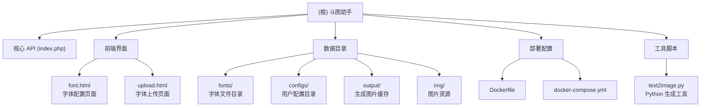

# 斗图助手 (doutu)

## 项目愿景

一个支持自定义字体样式、自动生成表情图片的 API 服务，专为微信聊天场景设计。用户可以通过简单的配置界面自定义字体、颜色、背景和特效，快速生成个性化表情图片。

## 架构总览

这是一个单应用项目，采用经典的 PHP 后端 + 纯前端架构：

- **后端**: PHP 8.2 + GD 图像库，提供 RESTful API
- **前端**: 原生 HTML/CSS/JavaScript，无框架依赖
- **部署**: 支持 Docker 容器化部署
- **数据**: 文件系统存储配置和生成的图片

## 模块结构图



## 模块索引

| 模块路径 | 语言 | 职责描述 | 状态 |
|---------|------|----------|------|
| `index.php` | PHP | 核心 API 服务，处理图片生成、配置管理、字体上传等请求 | ✅ 活跃 |
| `font.html` | HTML/CSS/JS | 字体配置界面，提供实时预览和样式调整 | ✅ 活跃 |
| `upload.html` | HTML/CSS/JS | 字体上传界面，支持拖拽和多文件上传 | ✅ 活跃 |
| `text2image.py` | Python | Python 版本的文字转图片工具（可选） | 📦 辅助 |
| `fonts/` | - | 字体文件存储目录 | 📁 数据 |
| `configs/` | - | 用户配置存储目录（JSON） | 📁 数据 |
| `output/` | - | 生成的图片缓存目录 | 📁 数据 |
| `img/` | - | 图片资源目录（背景图等） | 📁 数据 |
| `Dockerfile` | Docker | 容器化构建配置 | 🐳 部署 |
| `docker-compose.yml` | YAML | 容器编排配置 | 🐳 部署 |

## 运行与开发

### 快速启动

```bash
# 本地开发（PHP 内置服务器）
php -S 0.0.0.0:8000

# 访问配置页面
open http://localhost:8000/font.html
```

### Docker 部署

```bash
# 构建并启动容器
docker-compose up -d

# 容器运行在 http://localhost:8080
```

### 目录权限设置

```bash
chmod 755 index.php font.html upload.html
chmod 777 fonts configs output img
chmod 666 wxid.txt
```

### 常用命令

```bash
# PHP 语法检查
php -l index.php

# 测试 API 接口
curl "http://localhost:8000?ac=search&wxid=demo&keyword=hello"

# 查看生成缓存
ls -lt output/ | head
```

## 测试策略

### 功能测试

1. **授权测试**: 验证未授权用户返回替换文案
2. **配置测试**: 保存配置后重新加载验证一致性
3. **图片生成**: 检查 `output/` 目录是否生成文件
4. **字体上传**: 测试不同格式和大小限制

### 边界测试

- 空值、极端字号（12px-900px）
- 透明背景、随机颜色
- 长文本自动换行
- 不同分辨率下的响应式布局

### 性能测试

- 大文件上传（50MB 限制）
- 高并发图片生成
- 缓存清理机制验证

## 编码规范

### PHP 规范

- 遵循 PSR-12 代码风格
- 使用四个空格缩进
- 函数命名使用驼峰式，数组键使用蛇形
- 路径使用 `__DIR__` 常量组合，避免硬编码
- JSON 响应使用 `JSON_UNESCAPED_UNICODE` 保持中文可读性

### 前端规范

- 原生 JavaScript，无框架依赖
- 语义化 HTML，类名保持一致性（如 `btn-blue`、`field-desc`）
- CSS 使用内联样式，避免外部依赖
- 异步请求使用 `fetch` API

### 命名约定

- 新增前端元素使用 `data-` 属性或描述性类名
- 后端函数命名清晰表达意图（如 `drawNinePatch`、`maybeCleanupOutputs`）
- 配置项集中在 `$config` 数组内管理

## AI 使用指引

### 适合 AI 辅助的场景

1. **API 接口扩展**: 添加新的图片生成模式或特效
2. **前端优化**: 改进 UI 交互或响应式布局
3. **性能调优**: 优化图片生成算法或缓存策略
4. **文档完善**: 补充使用说明或 API 文档
5. **错误处理**: 增强异常捕获和日志记录

### 修改建议流程

1. 先在本地测试新功能
2. 确保向后兼容现有配置格式
3. 更新相关文档（README.md、AGENTS.md）
4. 提交时包含清晰的 commit message
5. 必要时提供示例配置或截图

### 重要注意事项

- 保持配置格式的稳定性，避免破坏现有用户配置
- 新增参数时提供合理的默认值
- 涉及文件权限的修改需要明确说明
- Docker 镜像变更需更新版本号

## 变更记录 (Changelog)

### 2026-01-28

- 新增模块结构图和完整的 AI 上下文文档
- 整理项目模块索引和职责描述
- 补充测试策略和编码规范

---

## 相关文件清单

```
项目根目录/
├── index.php           # 核心 API 服务（1740 行）
├── font.html           # 字体配置页面（1050 行）
├── upload.html         # 字体上传页面（295 行）
├── text2image.py      # Python 生成工具
├── Dockerfile          # 容器化构建配置
├── docker-compose.yml  # 容器编排配置
├── wxid.txt           # 授权用户列表
├── fonts/             # 字体文件目录
├── configs/           # 用户配置目录（JSON）
├── output/            # 生成图片缓存
├── img/               # 图片资源目录
└── .spec-workflow/    # Spec Workflow 工具目录
```

## 技术栈

- **后端**: PHP 8.2, GD 库
- **前端**: 原生 HTML5, CSS3, JavaScript (ES6+)
- **容器**: Docker, Docker Compose
- **辅助**: Python 3.9, PIL (可选)

## 许可证

[Unlicense](LICENSE) - 公共领域，可自由使用、修改、分发
